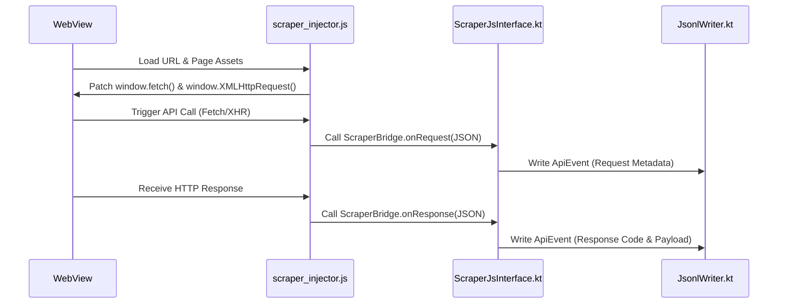

# ChorandApp — Premium Android Network Interceptor & Scraper

ChorandApp is a high-performance, developer-focused Android network capture and traffic analysis tool. Designed with a dark mode aesthetic, it enables developers to intercept, organize, inspect, sanitize, and export WebView-based and system-wide HTTP/DNS requests.

---

## 🌟 Key Features

### 1. WebView Scraper Mode
* **JavaScript Traffic Injection**: Injects a custom patcher ([scraper_injector.js](file:///Users/apple/Documents/Work/Projects/AndroidNativeProjects/ChorandApp/app/src/main/assets/scraper_injector.js)) into the loaded page.
* **XHR & Fetch Wrapping**: Intercepts outgoing requests and incoming responses (headers, status codes, request/response bodies, durations) at the browser execution level.
* **Anti-Bot Defenses**: Stubs modern fingerprints (e.g. `navigator.webdriver = false`, `window.chrome`, `navigator.plugins`) to bypass automation detection.

### 2. Global VPN Interceptor Mode
* **Android `VpnService`**: Establishes a local network loopback interface to intercept outbound traffic.
* **Local DNS Hijacking**: Captures and parses DNS query payloads (UDP Port 53) to log all target domains the device attempts to resolve.
* **Protected Forwarding**: Queries the active gateway DNS server (or falls back to Cloudflare/Google DNS) via VPN-protected sockets to prevent routing loops, resolving hosts while logging latency and error codes.

### 3. Capture Summary & Analytics
* **Overview Metrics**: Provides counts of total events, requests, responses, and errors.
* **Response Status Breakdown**: Tracks 2xx Successes, 4xx Client Errors, and 5xx Server Errors.
* **Latency & Timing Tracker**: Highlights timestamps of the first and last recorded events.
* **File Metadata**: Shows file sizes and paths of the active session.

### 4. Advanced Grouping Engines
Users can dynamically categorize recorded events in the summary view by:
* **None**: Flat chronological card list.
* **Domain**: Merges all requests to the same host name (e.g. `api.github.com`).
* **Endpoint**: Groups by the URL path (e.g. `/v1/users`).
* **Status**: Groups by status code or message (e.g. `200 OK`, `Error: Connection Timeout`).
* **HTTP Method**: Separates traffic by `GET`, `POST`, `CONNECT`, etc.

*Clicking any group card opens a nested [GroupedEventsActivity](file:///Users/apple/Documents/Work/Projects/AndroidNativeProjects/ChorandApp/app/src/main/java/com/chorand/app/GroupedEventsActivity.kt) displaying all sub-events.*

### 5. Swipe-to-Delete Data Sanitization
* Swipe event or group cards horizontally (left/right) to delete them.
* Deletion triggers a **background IO task** that filters out the events and serializes the remaining log back to the `.jsonl` file on disk.
* Updates overview counters and file size metrics dynamically.
* Features a custom-rendered red canvas swipe background with a trash bin vector icon.

### 6. Pretty-Printing & Inspection Sheets
* Tapping a tile pulls up a Material Bottom Sheet inspector.
* Tab-based layout separating **Headers**, **Request Payload**, and **Response Body**.
* Formats raw strings and pretty-prints JSON payloads with collapsible lists.
* Copy-to-clipboard utilities for individual fields or the entire event.

---

## 🛠️ Architecture & Core Logics

### 📂 File Structure Highlights

```
ChorandApp/
├── app/src/main/
│   ├── assets/
│   │   └── scraper_injector.js          # JavaScript monkey-patches for XHR/fetch
│   ├── java/com/chorand/app/
│   │   ├── ApiEvent.kt                 # Core Serializable Data Model
│   │   ├── LocalVpnService.kt          # Local VPN & DNS packet handler
│   │   ├── ScraperJsInterface.kt       # WebView JavascriptInterface bridge
│   │   ├── SessionManager.kt           # SharedPrefs state manager (Resume/Pause)
│   │   ├── JsonlWriter.kt              # Thread-safe GSON file serialization
│   │   ├── SummaryActivity.kt          # Capture analytics & grouping controller
│   │   └── GroupedEventsActivity.kt    # Nested group list activity
```

### 🌉 The JavaScript Interceptor Bridge



### 🛰️ VPN Packet Processing Engine

1. `LocalVpnService` configures a virtual IP address `10.0.0.1` and points system DNS to `10.0.0.2`.
2. Reads raw bytes from the virtual interface into a `ByteBuffer`.
3. Validates IPv4 headers and isolates UDP packets destined for Port 53.
4. Extracts domain names from DNS question records.
5. Emits `ApiEvent` (type="request", method="CONNECT", url="https://...") to disk.
6. Resolves DNS query concurrently using `DatagramSocket.protect()` to bypass the VPN tunnel.
7. Logs response resolution details (`ApiEvent`) and rebuilds/writes a valid UDP response packet back into the local interface stream.

---

## 💾 Capture File Format (.jsonl)

All captured traffic is logged in JSON Lines format (one JSON object per line) inside the app's internal files directory (`captures/chorand_capture_[timestamp].jsonl`).

```json
{"timestamp":1717758360000,"eventId":"3b26c6d0-2580-496a-939e-4c07c6f0ea99","type":"request","url":"https://api.example.com/data","method":"GET","requestHeaders":{"Accept":"application/json"},"initiator":"fetch"}
{"timestamp":1717758360150,"eventId":"3b26c6d0-2580-496a-939e-4c07c6f0ea99","type":"response","url":"https://api.example.com/data","method":"GET","status":200,"statusText":"OK","responseHeaders":{"Content-Type":"application/json"},"responseBody":"{\"status\":\"success\"}","durationMs":150,"initiator":"fetch"}
```

---

## 🚀 Build and Run

### Prerequisites
* JDK 17
* Android SDK (Target 34, Minimum 26)
* Gradle 8.0+

### Compilation
Verify compiling the project using Gradle:
```bash
./gradlew compileDebugSources
```

To assemble a debug APK:
```bash
./gradlew assembleDebug
```
